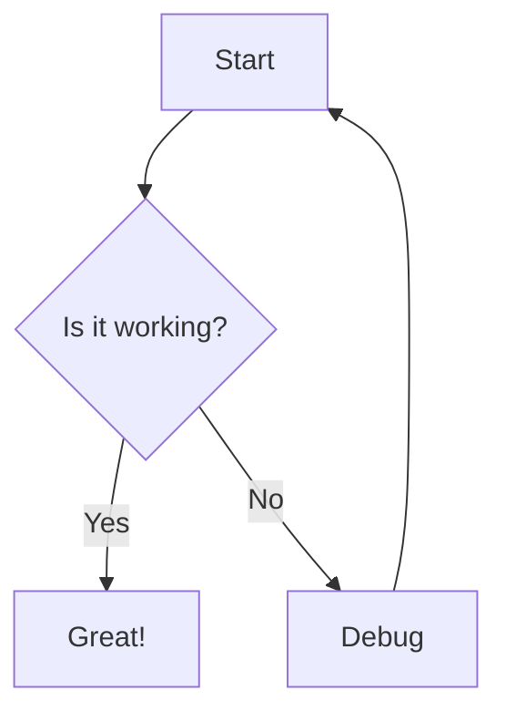

The `Mermaid` component handles rendering of mermaid diagrams from markdown code blocks. It uses the mermaid library to convert diagram definitions into SVG output.

## Props

<ParamField path="chart" type="string" required>
  The mermaid diagram definition string to render.
</ParamField>

## Initialization

Mermaid is initialized once when the module loads:

```jsx
import mermaid from 'mermaid';

mermaid.initialize({
  startOnLoad: false,
  theme: 'dark', // Since it's a dark mode app
  securityLevel: 'loose',
});
```

- `startOnLoad: false`: Manual rendering control
- `theme: 'dark'`: Matches the application's dark mode design
- `securityLevel: 'loose'`: Allows more flexible diagram features

## Rendering process

The component uses an effect to render diagrams asynchronously:

```jsx
useEffect(() => {
  let isMounted = true;

  const renderChart = async () => {
    try {
      setError(false);
      const id = `mermaid-${Date.now()}-${Math.floor(Math.random() * 10000)}`;
      const { svg } = await mermaid.render(id, chart);
      if (isMounted) {
        setSvgContent(svg);
      }
    } catch (err) {
      console.error("Mermaid generation error", err);
      if (isMounted) {
        setError(true);
      }
    }
  };

  if (chart) {
    renderChart();
  }

  return () => {
    isMounted = false;
  };
}, [chart]);
```

### Unique ID generation

Each diagram gets a unique ID to prevent conflicts:

```jsx
const id = `mermaid-${Date.now()}-${Math.floor(Math.random() * 10000)}`;
```

### Mounted check

The `isMounted` flag prevents state updates after unmounting:

```jsx
let isMounted = true;
// ... async operations ...
if (isMounted) {
  setSvgContent(svg);
}
return () => {
  isMounted = false;
};
```

## Error handling

When diagram syntax is invalid, an error message is displayed:

```jsx
if (error) {
  return (
    <div 
      className="mermaid-error" 
      style={{ 
        color: 'red', 
        padding: '10px', 
        border: '1px solid red', 
        borderRadius: '4px' 
      }}
    >
      Found syntax error in Mermaid diagram.
    </div>
  );
}
```

## SVG output

The rendered SVG is inserted using `dangerouslySetInnerHTML`:

```jsx
return (
  <div 
    className="mermaid-container" 
    ref={containerRef} 
    dangerouslySetInnerHTML={{ __html: svgContent }} 
    style={{ display: 'flex', justifyContent: 'center', margin: '20px 0' }}
  />
);
```

The container centers the diagram with consistent spacing.

## Integration with MarkdownRenderer

The component is used by `MarkdownRenderer` when it detects mermaid code blocks:

```jsx
import Mermaid from './Mermaid';

<ReactMarkdown 
  components={{
    code({node, inline, className, children, ...props}) {
      const match = /language-(\w+)/.exec(className || '');
      if (!inline && match && match[1] === 'mermaid') {
        return <Mermaid chart={String(children).replace(/\n$/, '')} />;
      }
      return <code className={className} {...props}>{children}</code>;
    }
  }}
>
  {content}
</ReactMarkdown>
```

## Example markdown usage

In your markdown files, define mermaid diagrams using code blocks:

````markdown

````

This will be automatically rendered as an interactive SVG diagram.