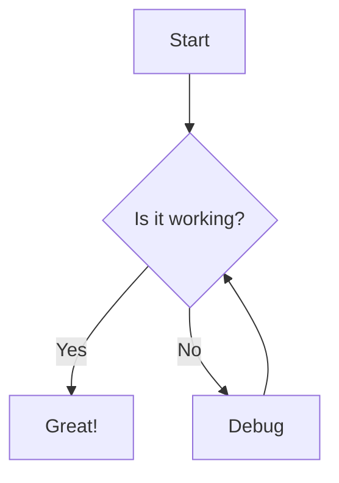

MD Viewer includes built-in support for Mermaid diagrams, allowing you to create flowcharts, sequence diagrams, class diagrams, and more directly in your markdown files.

## How to use

Create Mermaid diagrams using code fences with the `mermaid` language identifier:

````markdown

````

The MarkdownRenderer detects Mermaid code blocks and renders them as diagrams:

```jsx src/components/MarkdownRenderer.jsx
<ReactMarkdown 
  remarkPlugins={[remarkGfm]}
  components={{
    code({node, inline, className, children, ...props}) {
      const match = /language-(\w+)/.exec(className || '');
      if (!inline && match && match[1] === 'mermaid') {
        return <Mermaid chart={String(children).replace(/\n$/, '')} />;
      }
      return <code className={className} {...props}>{children}</code>;
    }
  }}
>
  {content}
</ReactMarkdown>
```

## Implementation

The Mermaid component handles diagram rendering with proper error handling.

### Initialization

Mermaid is initialized with a dark theme and secure settings:

```jsx src/components/Mermaid.jsx
import mermaid from 'mermaid';

mermaid.initialize({
  startOnLoad: false,
  theme: 'dark',
  securityLevel: 'loose',
});
```

<Info>
The `startOnLoad: false` setting gives us control over when diagrams are rendered, allowing for better error handling and performance.
</Info>

### Rendering

The component uses React hooks to render diagrams asynchronously:

```jsx src/components/Mermaid.jsx
export default function Mermaid({ chart }) {
  const containerRef = useRef(null);
  const [svgContent, setSvgContent] = useState('');
  const [error, setError] = useState(false);

  useEffect(() => {
    let isMounted = true;

    const renderChart = async () => {
      try {
        setError(false);
        const id = `mermaid-${Date.now()}-${Math.floor(Math.random() * 10000)}`;
        const { svg } = await mermaid.render(id, chart);
        if (isMounted) {
          setSvgContent(svg);
        }
      } catch (err) {
        console.error("Mermaid generation error", err);
        if (isMounted) {
          setError(true);
        }
      }
    };

    if (chart) {
      renderChart();
    }

    return () => {
      isMounted = false;
    };
  }, [chart]);

  return (
    <div 
      className="mermaid-container" 
      ref={containerRef} 
      dangerouslySetInnerHTML={{ __html: svgContent }} 
      style={{ display: 'flex', justifyContent: 'center', margin: '20px 0' }}
    />
  );
}
```

### Unique IDs

Each diagram gets a unique ID to prevent conflicts when multiple diagrams are rendered:

```jsx src/components/Mermaid.jsx
const id = `mermaid-${Date.now()}-${Math.floor(Math.random() * 10000)}`;
```

## Example diagrams

Here are some common diagram types you can create:

<Tabs>
  <Tab title="Flowchart">
    ````markdown
    ```mermaid
    graph LR
        A[Square Rect] --> B((Circle))
        A --> C(Rounded Rect)
        B --> D{Rhombus}
        C --> D
    ```
    ````

    Perfect for process flows and decision trees.
  </Tab>

  <Tab title="Sequence diagram">
    ````markdown
    ```mermaid
    sequenceDiagram
        participant A as Alice
        participant B as Bob
        A->>B: Hello Bob, how are you?
        B->>A: Great!
    ```
    ````

    Useful for showing interactions between components or users.
  </Tab>

  <Tab title="Class diagram">
    ````markdown
    ```mermaid
    classDiagram
        Animal <|-- Duck
        Animal <|-- Fish
        Animal : +int age
        Animal : +String gender
        class Duck{
            +String beakColor
            +swim()
        }
        class Fish{
            -int sizeInFeet
            -canEat()
        }
    ```
    ````

    Great for documenting object-oriented designs.
  </Tab>

  <Tab title="State diagram">
    ````markdown
    ```mermaid
    stateDiagram-v2
        [*] --> Still
        Still --> [*]
        Still --> Moving
        Moving --> Still
        Moving --> Crash
        Crash --> [*]
    ```
    ````

    Ideal for state machines and workflows.
  </Tab>
</Tabs>

## Error handling

When a Mermaid diagram has syntax errors, the component displays a clear error message:

```jsx src/components/Mermaid.jsx
if (error) {
  return (
    <div 
      className="mermaid-error" 
      style={{ 
        color: 'red', 
        padding: '10px', 
        border: '1px solid red', 
        borderRadius: '4px' 
      }}
    >
      Found syntax error in Mermaid diagram.
    </div>
  );
}
```

<Warning>
Mermaid syntax errors will prevent the diagram from rendering. Check the browser console for detailed error messages.
</Warning>

## Styling

Diagrams are centered and given vertical spacing:

```jsx src/components/Mermaid.jsx
<div 
  className="mermaid-container" 
  ref={containerRef} 
  dangerouslySetInnerHTML={{ __html: svgContent }} 
  style={{ display: 'flex', justifyContent: 'center', margin: '20px 0' }}
/>
```

## Supported diagram types

MD Viewer supports all Mermaid diagram types through the `mermaid` library (version 11.12.3):

- Flowcharts
- Sequence diagrams
- Class diagrams
- State diagrams
- Entity relationship diagrams
- User journey diagrams
- Gantt charts
- Pie charts
- Git graphs
- And more

Refer to the [Mermaid documentation](https://mermaid.js.org/) for complete syntax guides.

## Performance considerations

The component includes several performance optimizations:

### Async rendering

Diagrams are rendered asynchronously to prevent blocking the UI:

```jsx src/components/Mermaid.jsx
const renderChart = async () => {
  try {
    setError(false);
    const id = `mermaid-${Date.now()}-${Math.floor(Math.random() * 10000)}`;
    const { svg } = await mermaid.render(id, chart);
    if (isMounted) {
      setSvgContent(svg);
    }
  } catch (err) {
    console.error("Mermaid generation error", err);
    if (isMounted) {
      setError(true);
    }
  }
};
```

### Cleanup

The component properly cleans up when unmounted:

```jsx src/components/Mermaid.jsx
useEffect(() => {
  let isMounted = true;

  // ... rendering logic

  return () => {
    isMounted = false;
  };
}, [chart]);
```

This prevents memory leaks and state updates on unmounted components.

## Dependencies

Mermaid support requires the following package:

```json package.json
{
  "dependencies": {
    "mermaid": "^11.12.3"
  }
}
```