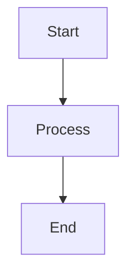

# Welcome to MD Viewer

MD Viewer is a sleek desktop-style markdown viewer that brings the elegance of macOS design to your browser. Built with React and Vite, it provides a distraction-free environment for reading and managing markdown files with a stunning glassmorphism UI.

<CardGroup cols={2}>
  <Card title="Quickstart" icon="rocket" href="/quickstart">
    Get up and running with MD Viewer in under 2 minutes
  </Card>
  <Card title="Features" icon="sparkles" href="/features/markdown-rendering">
    Explore the powerful features that make MD Viewer stand out
  </Card>
</CardGroup>

## What is MD Viewer?

MD Viewer transforms the way you interact with markdown files. Instead of switching between editors and preview modes, MD Viewer provides a dedicated, beautiful rendering experience that focuses on readability and user experience.

Whether you're reviewing documentation, reading technical guides, or organizing notes, MD Viewer's intuitive interface keeps you focused on the content.

## Key features

### GitHub-flavored markdown support

Full support for GitHub-flavored markdown (GFM) using `react-markdown` and `remark-gfm`, including:

- Tables with proper formatting
- Strikethrough text
- Task lists with checkboxes
- Autolink literals
- Footnotes

### Mermaid diagram rendering

Visualize complex diagrams directly in your markdown files. MD Viewer automatically renders Mermaid diagrams in code blocks, supporting flowcharts, sequence diagrams, class diagrams, and more.

```markdown

```

### Glassmorphism UI design

Experience a modern, macOS-inspired interface with:

- Translucent frosted glass effects
- Smooth animations and transitions
- System font integration (-apple-system, BlinkMacSystemFont)
- Carefully crafted spacing and typography
- Dark mode optimized for reduced eye strain

### Advanced file management

Effortlessly manage multiple markdown files:

- **Drag and drop** files anywhere in the window
- **Multiple file support** with a clean sidebar interface
- **Create new files** instantly with the new file button
- **Persistent storage** using localStorage to save your session
- **File switching** with a single click

### Typography controls

Fine-tune your reading experience with granular font size controls:

- Scale from 50% to 200% using the toolbar buttons
- Real-time preview of size changes
- Preserved settings across sessions
- Independent scaling of markdown content

### Smart toolbar

The toolbar intelligently hides when scrolling down to maximize reading space and reappears when scrolling up, giving you more screen real estate when you need it.

## Technology stack

MD Viewer is built with modern web technologies:

- **React 19** - Latest React with improved performance
- **Vite** - Lightning-fast build tool and dev server
- **react-markdown** - Secure markdown rendering
- **remark-gfm** - GitHub-flavored markdown support
- **Mermaid** - Diagram and flowchart rendering
- **Lucide React** - Beautiful, consistent icons

<Note>
MD Viewer stores your files in browser localStorage, making it perfect for quick markdown viewing sessions. Your files persist between sessions but remain private to your browser.
</Note>

## Use cases

- **Documentation review** - Read API docs, guides, and REALMEs with beautiful formatting
- **Note taking** - Create and manage markdown notes in a distraction-free environment
- **Content preview** - Preview markdown content before publishing
- **Learning resources** - Study technical materials with diagram support
- **Project planning** - View project documentation with embedded flowcharts