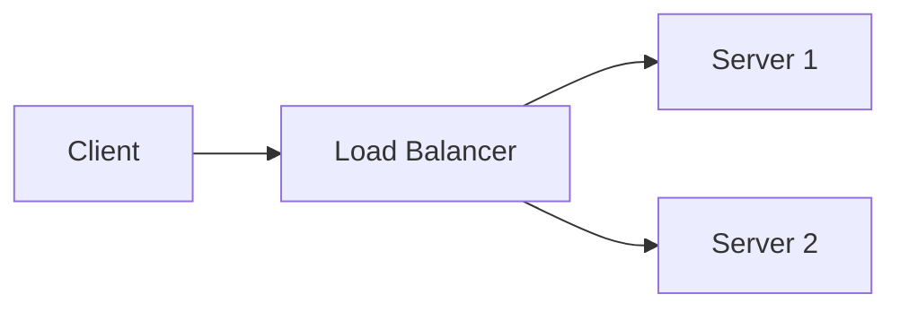

# Get started with MD Viewer

This guide will help you set up and start using MD Viewer on your local machine.

## Prerequisites

Before you begin, make sure you have:

- **Node.js** (version 16 or higher)
- **npm** or **yarn** package manager
- A terminal or command prompt

## Installation

<Steps>
  <Step title="Clone the repository">
    Open your terminal and clone the MD Viewer repository:
    
    ```bash
    git clone https://github.com/anuragvishwa/md-viewer.git
    cd md-viewer
    ```
  </Step>

  <Step title="Install dependencies">
    Install all required packages using npm:
    
    ```bash
    npm install
    ```
    
    This will install the following key dependencies:
    - `react` and `react-dom` - Core React libraries
    - `react-markdown` and `remark-gfm` - Markdown rendering
    - `mermaid` - Diagram support
    - `lucide-react` - Icon library
    - `vite` - Build tool and dev server
  </Step>

  <Step title="Start the development server">
    Launch the application in development mode:
    
    ```bash
    npm run dev
    ```
    
    Vite will start the development server and display a local URL (typically `http://localhost:5173`).
    
    <Tip>
    Vite's dev server includes hot module replacement (HMR), so your changes will appear instantly without refreshing the page.
    </Tip>
  </Step>

  <Step title="Open in your browser">
    Open the URL shown in your terminal (usually `http://localhost:5173`) in your web browser.
    
    You should see the MD Viewer interface with a welcome file already loaded.
  </Step>
</Steps>

## Opening your first markdown file

Once MD Viewer is running, you have three ways to open markdown files:

### Method 1: Drag and drop

Simply drag any `.md` or `.markdown` file from your file explorer and drop it anywhere in the MD Viewer window. The file will be loaded instantly.

```jsx
// From App.jsx:92-109 - Drag and drop handling
const handleDragOver = useCallback((e) => {
  e.preventDefault();
  setIsDragging(true);
}, []);

const handleDrop = useCallback((e) => {
  e.preventDefault();
  setIsDragging(false);
  
  if (e.dataTransfer.files && e.dataTransfer.files.length > 0) {
    loadFile(Array.from(e.dataTransfer.files));
  }
}, []);
```

### Method 2: Upload button

Click the upload icon (↑) in the sidebar header to open a file picker dialog. You can select one or multiple markdown files at once.

### Method 3: Create a new file

Click the plus icon (+) in the sidebar to create a new untitled markdown file with starter content:

```jsx
// From App.jsx:111-119 - New file creation
const handleNewFile = () => {
  const newFile = {
    id: Date.now().toString(),
    name: `Untitled-${files.length}.md`,
    content: '# New Document\n\nStart typing here...'
  };
  setFiles(prev => [newFile, ...prev]);
  setActiveFileId(newFile.id);
};
```

<Note>
MD Viewer accepts `.md`, `.markdown`, and `.txt` files. Multiple files can be uploaded simultaneously.
</Note>

## Managing files

### Switching between files

Click any file name in the sidebar to switch to that file. The active file is highlighted with a blue background.

### Removing files

Hover over a file in the sidebar and click the X button to remove it from your session.

```jsx
// From App.jsx:81-90 - File removal
const handleRemoveFile = (idToRemove, e) => {
  e.stopPropagation();
  setFiles(prev => {
    const newFiles = prev.filter(f => f.id !== idToRemove);
    if (activeFileId === idToRemove) {
      setActiveFileId(newFiles.length > 0 ? newFiles[0].id : null);
    }
    return newFiles;
  });
};
```

### Persistence

Your files are automatically saved to browser localStorage and will be restored when you reopen MD Viewer.

## Adjusting font size

Use the typography controls in the toolbar:

1. Click the smaller **T** button to decrease font size (minimum 50%)
2. Click the larger **T** button to increase font size (maximum 200%)
3. The current scale percentage is displayed between the buttons

```jsx
// From Toolbar.jsx:11-17 - Font size controls
const handleIncreaseFont = () => {
  setFontSizeFactor(prev => Math.min(prev + 0.1, 2.0));
};

const handleDecreaseFont = () => {
  setFontSizeFactor(prev => Math.max(prev - 0.1, 0.5));
};
```

## Testing Mermaid diagrams

Create or open a markdown file with a Mermaid code block to see diagram rendering in action:

````markdown
# My Diagram


````

The diagram will be automatically rendered using the Mermaid library.

<Tip>
Mermaid diagrams support multiple types: flowcharts, sequence diagrams, class diagrams, state diagrams, ER diagrams, and more. Check the [Mermaid documentation](https://mermaid.js.org/) for syntax details.
</Tip>

## Building for production

When you're ready to build MD Viewer for production:

```bash
npm run build
```

This creates an optimized build in the `dist` directory. You can preview the production build with:

```bash
npm run preview
```

## Next steps

<CardGroup cols={2}>
  <Card title="Explore features" icon="compass" href="/features/markdown-rendering">
    Learn about all the powerful features MD Viewer offers
  </Card>
  <Card title="Components" icon="cube" href="/components/overview">
    Explore the React components that power MD Viewer
  </Card>
</CardGroup>